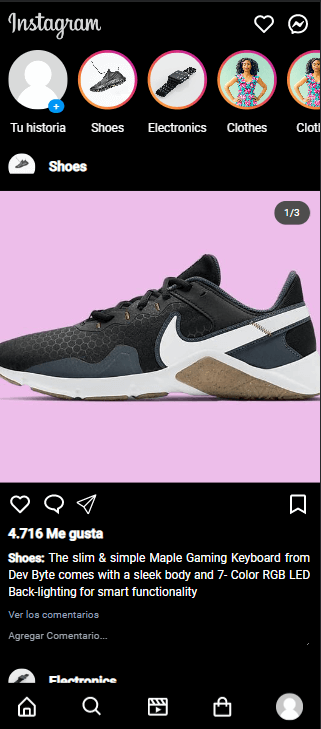
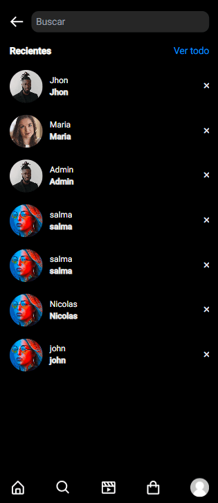
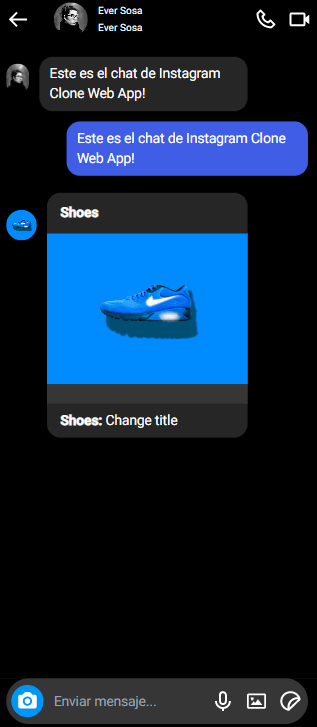
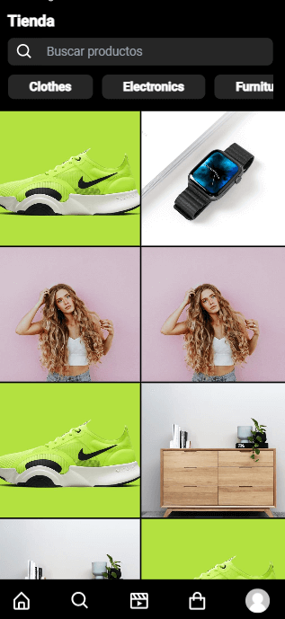
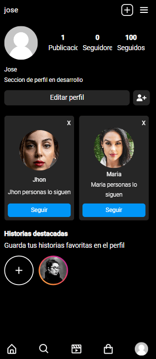

<p align="center">
    <a href="https://github.com/FedericoViveros2000/Instagram" target="_blank">
        
    </a>
</p>

# Instagram Clone Web App 

Este es un clon de Instagram desarrollado con tecnologías web como lo son HTML, CSS, Javascript (utilizando el framework progresivo Vue js).

<div style="width: 100%; display: flex; flex-wrap: wrap; justify-content: space-between;">
    <a href="https://federicoviveros2000.github.io/Instagram/" target="_blank">
        <figure>
            
        </figure>
    </a>
    <a href="https://federicoviveros2000.github.io/Instagram/discover" target="_blank">
        <figure>
            
        </figure>
    </a>
    <a href="https://federicoviveros2000.github.io/Instagram/users" target="_blank">
        <figure>
            
        </figure>
    </a>
    <a href="https://federicoviveros2000.github.io/Instagram/reels" target="_blank">
        <figure>
            
        </figure>
    </a>
    <a href="https://federicoviveros2000.github.io/Instagram/" target="_blank">
        <figure>
            
        </figure>
    </a>
    <a href="https://federicoviveros2000.github.io/Instagram/Profile" target="_blank">
        <figure>
            
        </figure>
    </a>
</div>

## Caracteristicas
* Incorpora el sistema de navegación mediante *Infinity Scroll*, el cual nos permite optimizar la carga de los Posts y recursos de la aplicación.

* Incorpora  para la carga diferida de imagenes, el cual provee una mayor sensación de velocidad y fluidez al usuario.

* Para el proceso de carga de los posts, utiliza el sistema de *spinners* mediante el cual da un mayor sensación de control al usuario respecto al estado en el cual se encuentra la aplicación.

* Posee un sistema de enrutamiento mediante el cual dirigimos al usuario, a la funcionalidad que quiera utilizar.

* Incorpora la característica nativa de adaptar el tema o modo de la aplicación (modo oscuro o claro) de acuerdo a la configuración del sistema.

* Posee la capacidad de poder instalarse en el dispositivo como una .

## API REST utilizada.

<a href="https://fakeapi.platzi.com/">
    <figure style="width: 100%;display: flex; align-items: center; justify-content: center;">
        <svg width="60" height="60" fill="#98ca3f" viewBox="0 0 24 24">
            <path d="M10.64 1.127L2.487 9.282a3.842 3.842 0 000 5.436l8.155 8.155a3.842 3.842 0 005.436 0l2.719-2.718-2.719-2.718-2.718 2.718L5.204 12l8.155-8.155 5.437 5.437-5.437 5.436 2.718 2.719L21.514 12a3.842 3.842 0 000-5.437l-5.448-5.436a3.828 3.828 0 00-5.425 0Z"></path>
        </svg> 
        <h1 style="margin-left: 7px; cursor: pointer;"> Platzi Fake Store API</h1>
    </figure>
</a>

La API REST utilizada para esta ocasión fue la de . Con los siguientes endpoints:


* Para obtener las categorias de los productos de la tienda:

 ```
🔗 https://api.escuelajs.co/api/v1/categories
 ```

 * Para obtener los posts y productos de la tienda mediante un paginado, obtenido por el sistema de *Infinity Scrolling*:

```
🔗 https://api.escuelajs.co/api/v1/products?offset={nroPagina}&limit={cantidad}
```

* Para obtener el post o producto particular seleccionado:

```
🔗 https://api.escuelajs.co/api/v1/products/{idProducto}
```

* Para obtener los contactos y usuarios de la aplicación:

```
🔗 https://api.escuelajs.co/api/v1/users
```

## Tecnologías Utilizadas:

| Tecnología               | Descripción                                                       | Documentación                                             |
| --------------------- | ------------------------------------------------------------ | ------------------------------------------------------- |
| Vue js | Framework progresivo utilizado para desarrollar la aplicación. |https://vuejs.org/|
|Vue Router| Librería de mediante la cual manejamos el enrutamiento de nuestra aplicacion.| https://router.vuejs.org/ |
|Vuex| Librería utilizada para la gestión general del estado de la aplicación. |https://vuex.vuejs.org/|
Vite js| Entorno de desarrollo utilizado para crear y modificar la aplicación, este nos provee una mayor fluidez y rápidez a la hora de desarrollarla.| https://vitejs.dev/
| Vite PWA | Plugin mediante el cual podemos instalar nuestra aplicacion como una aplicación progresiva | https://vite-pwa-org.netlify.app/guide/
| Tailwind CSS | Framework utilizado para manejar los estilos y animaciones de la aplicación. | https://tailwindcss.com/ 
| Axios | Librería mediante la cual realizamos las peticiones a HTTP de la API REST [Fake Store API](https://fakeapi.platzi.com/). | https://axios-http.com/docs/intro
|npm | Sistema Gestor de Paquetes utilizado para descargar, actualizar y gestionar todas las dependencias necesarias para que la aplicación funcione. | https://docs.npmjs.com/
|Git | Sistema de Control de Versiones utilizado para llevar un control de las versiones y actualizaciones de la aplicación. | https://git-scm.com/docs/git
|Github | Plataforma remota en la cual almacenamos la aplicación y sus versiones. | https://docs.github.com/es

## Observación: 
```
Esta aplicación actualmente se encuentra en desarrollo, por lo cual puede presentar errores y modificaciones.
Solo se encuentra disponible para dispositivos móviles.
```

## Autor

* José Viveros .

## Contacto

* Gmail: josevivers2000@gmail.com


